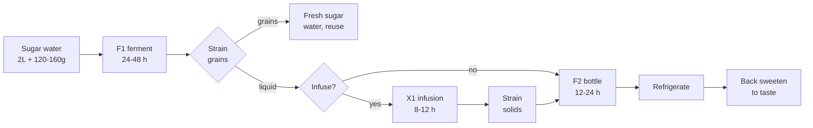

## Ingredients

### F1, First Ferment

- 100g water kefir grains
- 2 litres filtered water
- 120-160g sugar
- Pinch of sea salt
- 15ml lemon juice

### F2, Second Ferment

- Stevia to back sweeten, optional

For the X1 infusion, pick one of the options below. It is optional; skip it for
plain kefir.

## Method

### Stage 1, Ferment

1. Dissolve the sugar in a little warm filtered water, then top up to 2 litres
   and let it come to room temperature. The grains do not like heat.
2. Add the sea salt and lemon juice.
3. Add the grains, cover loosely so gas can escape, and leave at room
   temperature for 24 to 48 hours. Shorter for a sweeter drink, longer for a
   drier, more sour one.
4. Strain out the grains and keep them back for the next batch.

### Stage 2, Infuse

1. Optional. Add an infusion to the strained liquid, choosing from the variants
   below. Skip this and the kefir is plain and clean, which is a fine drink on
   its own. The grains are already out, so nothing here is feeding them.
2. Cover and leave to infuse overnight at room temperature, roughly 8 to 12
   hours. This is the stage that carries the flavour, so do not cut it short.
3. Strain out the solids. A fine mesh sieve over a jug is enough for mint,
   ginger or hibiscus. For berries, line the sieve with muslin or a clean tea
   towel, since crushed fruit leaves pulp that clogs the sieve and later fouls
   the bottle. Do not press the solids through, as that pushes sediment into the
   drink. Let it drain.

### Stage 3, Carbonate

1. Bottle the infused liquid and seal.
2. Leave at room temperature for 12 to 24 hours to build carbonation. Burp the
   bottles daily unless you are using proper flip-tops.
3. Refrigerate to stop the ferment.
4. Back sweeten with stevia to taste before drinking. A little goes a long way.

## X1 Infusion

All optional. Pick one, or skip X1 entirely for plain kefir. The method does not
change: infuse overnight, strain, then bottle for F2.

### Lemon Mint

- Mint leaves
- Dash of lime
- 15ml apple cider vinegar

### Ginger

- 30g fresh ginger, sliced thin
- Dash of lemon

Sharper and warming. The ginger also feeds a little wild yeast, so expect a
livelier F2 and burp the bottles more often.

### Berry

- 100g fresh or frozen berries, lightly crushed

Fruit sugars restart fermentation, so this one builds pressure fast. Cut F2 to
12 hours and refrigerate promptly.

### Hibiscus and Lime

- 2 tbsp dried hibiscus
- Dash of lime

Deep red and tart, with no added sugar. Hibiscus is already acidic, so skip the
vinegar here.

## Notes

- The sugar is food for the grains, not for you. The aim is to ferment out as
  much of it as possible. A long F1 gets you close to dry, and around 0.5g of
  residual sugar per 100ml is a realistic floor. True zero is not achievable
  because the grains need something left to stay alive.
- To push it lower, run F1 the full 48 hours and taste from 24 hours onward. It
  should go from sweet to tart to faintly vinegary. Stop at tart. Warmth speeds
  this up, so a colder room needs longer.
- Do not cut the starting sugar to compensate. Underfeeding starves the grains
  and they stop working. Use the full 120-160g and ferment it out instead.
- Any sugar you add back at the end is yours to control, so back sweeten with
  stevia rather than sugar if you want it sweeter without the carbohydrate.
- Keep the grains in a fresh sugar-water solution between batches. They are
  living and need feeding.
- The lemon juice in F1 is for the grains, the lime in X1 is for flavour. Do not
  swap one for the other.

## Appendix

Total elapsed time is roughly 2 to 4 days, most of it unattended.

